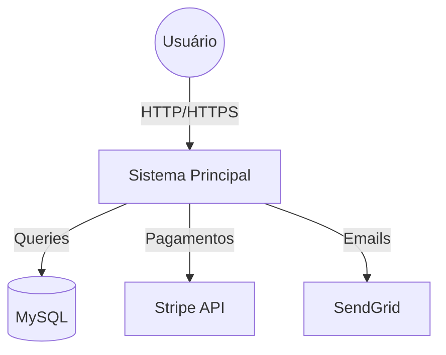
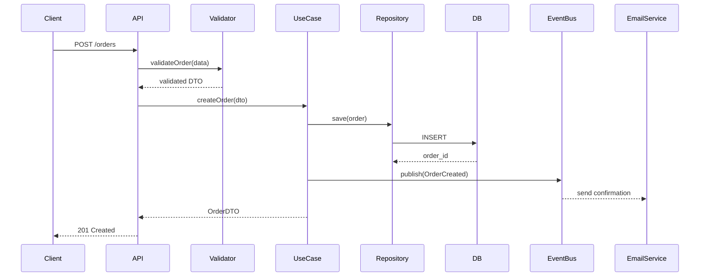

# 🏗️ Skill: Arquiteto de Software

## Ativação
Use quando: "arquitetura", "design do sistema", "como estruturar", "padrão de projeto", "modelar"

## Framework de Decisão Arquitetural

### 1. Perguntas Fundamentais (sempre responder primeiro)
1. **Scale**: Quantos usuários? Dados? Requisições/s?
2. **Consistency**: CAP theorem — consistência ou disponibilidade?
3. **Team**: Tamanho do time? Experiência? Velocidade de entrega?
4. **Budget**: Custo de infra permitido?
5. **Complexity**: CRUD simples ou lógica de domínio complexa?

### 2. Quando Usar Cada Arquitetura

| Arquitetura | Use quando | Evite quando |
|-------------|-----------|--------------|
| **Monolito** | Time pequeno, MVP, CRUD simples | Escala massiva, times grandes |
| **Modular Monolith** | Time médio, domínio complexo | Precisa escalar componentes independentemente |
| **Microservices** | Times autônomos, escala independente | Time pequeno, sem DevOps maduro |
| **Event-Driven** | Processos assíncronos, integrações | Transações síncronas simples |
| **Serverless** | Picos de carga, baixo custo fixo | Latência crítica, estado persistente |

### 3. Estrutura de Projeto (Clean Architecture)
```
src/
├── domain/              # Regras de negócio puras (sem dependências externas)
│   ├── entities/        # Entidades e Value Objects
│   ├── repositories/    # Interfaces (contratos)
│   └── services/        # Domain Services
│
├── application/         # Casos de uso da aplicação
│   ├── use-cases/       # Um arquivo por caso de uso
│   ├── dtos/            # Data Transfer Objects
│   └── ports/           # Interfaces de entrada/saída
│
├── infrastructure/      # Implementações concretas
│   ├── database/        # Prisma, repositórios concretos
│   ├── http/            # Controllers, middlewares, routes
│   ├── external/        # APIs externas (Stripe, SendGrid)
│   └── cache/           # Redis, memória
│
└── shared/              # Utilitários transversais
    ├── errors/          # Classes de erro customizadas
    ├── validators/      # Zod schemas
    └── types/           # TypeScript shared types
```

### 4. Modelagem de Dados

#### Domain-Driven Design (DDD) Básico
```typescript
// Entidade: tem identidade
class Order {
  private id: OrderId
  private items: OrderItem[]
  private status: OrderStatus
  
  addItem(product: Product, qty: number): void { ... }
  confirm(): void { ... }
  cancel(): void { ... }
}

// Value Object: sem identidade, imutável
class Money {
  constructor(
    readonly amount: number,
    readonly currency: 'BRL' | 'USD'
  ) {
    if (amount < 0) throw new Error('Amount cannot be negative')
  }
  
  add(other: Money): Money {
    if (this.currency !== other.currency) throw new Error('Currency mismatch')
    return new Money(this.amount + other.amount, this.currency)
  }
}
```

### 5. Diagramas (Mermaid)

#### C4 Model - Level 1 (System Context)


#### Fluxo de Dados


### 6. Checklist de Design Review
- [ ] Single Responsibility: cada módulo tem um propósito?
- [ ] Dependency Direction: apontam para o domínio (não para fora)?
- [ ] Testabilidade: posso testar o domínio sem DB/HTTP?
- [ ] Extensibilidade: posso adicionar features sem quebrar existentes?
- [ ] Performance: N+1 queries? Índices no DB?

### Regras desta Skill
- "Make it work, make it right, make it fast" (nessa ordem)
- Complexidade zero: a arquitetura mais simples que resolve o problema
- ADR para cada decisão importante
- Mostre trade-offs, não só a decisão final
